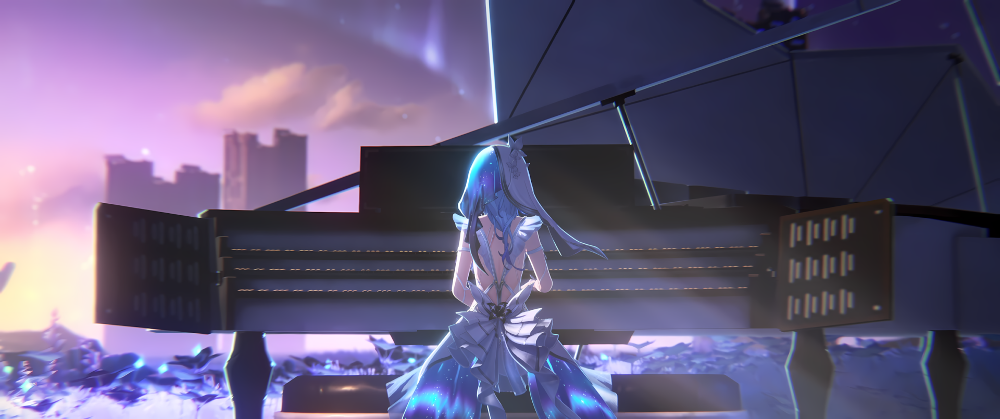

  <picture>
    <source
      srcset="../public/shorekeeper.png"
    />
    
  </picture>

   

# 🌌 Project ShoreKeeper

**A modular, open-source ecosystem enabling users to build, run, and interact with their own autonomous 2D AI VTuber/Companion.**
_(Local & Cloud supported)._

Inspired by _Neuro-sama_ (Vedal) & _Project AIRI_ & _Wuthering Waves_.

  <!-- 
  
   -->

 

## 🏛️ System Architecture (The 4 Pillars)

The ecosystem is heavily modularized into 4 microservices/components to ensure plug-and-play capability:

### 1. 👁️ Sensory Inputs (The Senses)

- **Hearing:** Real-time Speech-to-Text (STT) running on-device (**Web Audio API** + **ONNX/Silero VAD** + **Whisper**).
- **Vision:** Computer vision module for screen-reading and game state analysis.
- **Reading:** Real-time Twitch/YouTube chat integration.

### 2. 🧠 Cognitive Core (The Brain)

- **LLM Router:** Prompt engineering and routing queries to local/cloud LLMs (**Llama 3, Qwen**) with character persona (System Prompts).
- **Memory Engine:** Short-term (context) and Long-term memory (**Vector Database**) for viewer recognition.

### 3. 🗣️ Expression Output (The Body & Voice)

- **Vocal Cords:** Text-to-Speech (TTS) with emotional embedding.
- **Body (Live2D):** Audio-based lip-sync and LLM-triggered facial expressions/animations.

### 4. ✋ Agentic Actions (The Hands)

- Autonomous macro/input simulation for playing games or executing computer tasks.

 

## 🛠️ Tech Stack Per Module

We strictly adhere to a decoupled architecture. Code is expected to be modular, well-typed (**TypeScript/Pydantic**), and highly optimized for real-time AI latency.

### 🌐 Frontend / Client UI

_Responsible for UI, local VAD, and WebGPU tasks._

- **Core:** `React`, `Vite`, `TypeScript`
- **Styling & Components:** `TailwindCSS`, `Radix UI`
- **AI Models:** Hugging Face `transformers.js` (for web-based inference)

### ⚙️ Backend / Core Server

_Responsible for heavy AI inference, LLM routing, and Database management._

- **Core:** `Python`, `FastAPI`

  
  
  
  
  
  

 

## 🤝 Contributing

This project is open-source, and we welcome all contributions from the community!

1. Please read our [Contributing Guidelines](.github/blob/main/CONTRIBUTING.md).
2. Look for issues labeled `good first issue` in our repositories to get started.
3. Join our Discord server to chat directly with the core development team.
